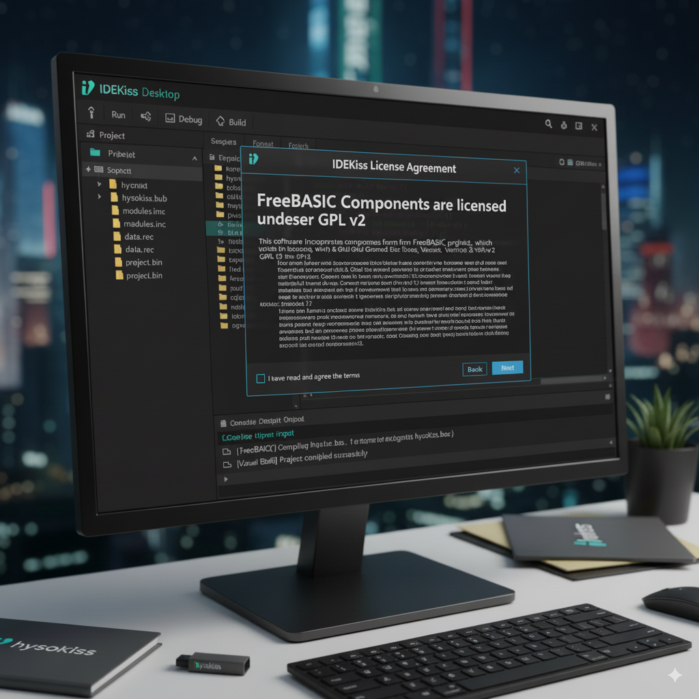

Okay, I can help you create a `README.md` file for your IDEKiss Desktop and Develop Files project, focusing on Visual Basic and FreeBASIC extensions.


____
Here's a draft:

```markdown
# IDEKiss Desktop and Develop Files

## Project Name: hysokiss

Welcome to the IDEKiss Desktop and Develop Files project! This repository contains various files related to the IDEKiss environment, primarily focusing on development with Visual Basic and FreeBASIC.

## Supported File Extensions:

This project and associated IDEKiss tools are designed to work with the following file types:

*   `.bas`: Visual Basic and FreeBASIC source code files.
*   `.bin`: Binary files, which could include compiled executables, object files, or data.
*   `.inc`: Include files, commonly used in FreeBASIC for declarations and macros.
*   `.rec`: Record files (specific usage might vary, often for data records or project-specific formats).
*   `.bin Project Name "./hysokiss"`: Indicates that the project itself is named "hysokiss" and might be associated with `.bin` files as its primary output or core component.

## Overview:

The IDEKiss environment aims to provide a streamlined experience for developing applications. Whether you're working on legacy Visual Basic projects or modern FreeBASIC applications, these files and tools are intended to assist in the development workflow.

## Getting Started:

(This section would typically include instructions on how to set up the IDEKiss environment, compile projects, or use the provided files. Since I don't have specifics on IDEKiss, this is a placeholder.)

1.  **Installation:** [Provide instructions for installing IDEKiss or required dependencies.]
2.  **Opening Projects:** [Explain how to open `.bas` or other project files within IDEKiss.]
3.  **Compilation:** [Detail the process for compiling `.bas` files into `.bin` executables.]

## Contributing:

(If this is an open-source project, you'd include contribution guidelines here.)

We welcome contributions! Please feel free to fork the repository, make your changes, and submit a pull request.

## License:

(Specify the licensing for your project here.)

This project is licensed under the [Your Chosen License Name] - see the `LICENSE` file for details.
```

Would you like me to generate an image that represents an IDE or coding environment, perhaps with some Visual Basic or FreeBASIC elements? 